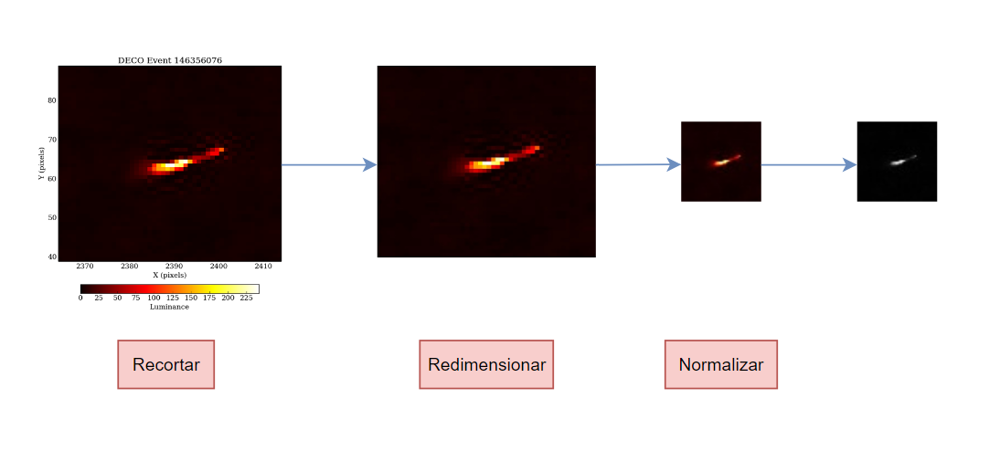
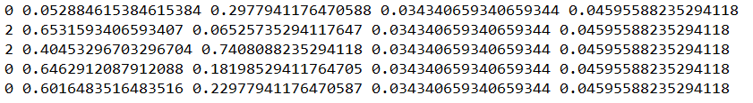

## Descripción

Este repositorio contiene scripts en Python para generar un dataset. El proceso implica la preparación de imágenes de spots, tracks y worms ubicadas en la carpeta Datos_Muestra. Las imagenes originales han sido extraidas de [https://www-old.wipac.wisc.edu/deco/data](https://www-old.wipac.wisc.edu/deco/data)

## Pasos para Generar el Dataset

1. Asegúrate de tener las carpetas `spot`, `track` y `worm` dentro de la carpeta `wrk_dir/Datos_Muestra` con las imágenes del dataset. En este caso `wrk_dir` será el directorio de trabajo, dentro de `src`.

2. Ejecuta los siguientes scripts en orden desde `wrk_dir`

   - `py_rename_files.py`
   - `py_crop_images.py`
   - `py_resize_images.py`
   - `py_normalized_images.py`
   - `py_modified_dataset.py`
   - `py_validate_modified_dataset.py`

Se obtiene el dataset en la carpeta `modified_webcam_dataset`. Además, se tienen dos `.csv` que contienen la información de cada imagen generada, donde uno de ellos contiene las coordenadas de las detecciones normalizadas con respecto a las medidas de la imagen. Un esquema del proceso realizado se puede ver en la siguiente imagen:

## Preparar el entrenamiento
Para entrenar el modelo es necesario preparar la carpeta `src/yolo`. Deberá tener la siguiente estructura:
### yolo folder structure
 * [train]
   * [images]
   * [labels]
 * [valid]
   * [images]
   * [labels]
 * [muones.yaml]

Se debe modificar el archivo `src/yolo/muones.yaml` introduciendo el path absoluto a las carpetas de `train` y `valid`, incluidas en la carpeta `src/yolo`. A su vez, las carpetas `train/images` y `valid/images` deben contener las imágenes de entrenamiento y validación. Finalmente,  las carpetas `train/labels` y `valid/labels` deben incluir un archivo .txt por cada imagen con el mismo nombre. En este archivo debe aparecer la información de cada detección introducida en las imágenes de la siguiente manera:

• Una fila por objeto.  
• Cada fila está en el formato: `class x_center y_center width height`.  
• Las coordenadas de la caja deben estar en formato XYWH normalizado (de 0 a 1). Si tus cajas están en píxeles, divide `x_center` y `width` por el ancho de la imagen, y `y_center` y `height` por la altura de la imagen.  
• Los números de clase están indexados desde cero (empiezan desde 0).  

Un ejemplo sería:

Para más información se puede consultar [https://docs.ultralytics.com/yolov5/tutorials/train_custom_data/](https://docs.ultralytics.com/yolov5/tutorials/train_custom_data/).

## Realizar el entrenamiento
Ejecutar el cuaderno `src/training_YOLO.ipynb`.

---

## Description

This repository contains Python scripts to generate a dataset. The process involves preparing images of spots, tracks, and worms located in the `wrk_dir/Datos_Muestra` folder. The original images have been extracted from [https://www-old.wipac.wisc.edu/deco/data](https://www-old.wipac.wisc.edu/deco/data).

## Steps to Generate the Dataset

1. Make sure to have the `spot`, `track`, and `worm` folders inside the `wrk_dir/Datos_Muestra` directory with the dataset images. Here, `wrk_dir` represents the working directory.

2. Execute the following scripts in order from `wrk_dir`:

   - `py_rename_files.py`
   - `py_crop_images.py`
   - `py_resize_images.py`
   - `py_normalized_images.py`
   - `py_modified_dataset.py`
   - `py_validate_modified_dataset.py`

The dataset will be generated in the `modified_webcam_dataset` folder. Additionally, two `.csv` files will be created containing the information for each generated image, where one of them includes the coordinates of the detections normalized relative to the dimensions of the image. A diagram of the process can be seen in the following image:

## Prepare Training Data

To train the model, you need to set up the `src/yolo` folder with the following structure:
### yolo folder structure
 * [train]
   * [images]
   * [labels]
 * [valid]
   * [images]
   * [labels]
 * [muones.yaml]

You should modify the `src/yolo/muones.yaml` file to include the absolute paths to the `train` and `valid` folders, which are inside the `src/yolo` folder. Additionally, the `train/images` and `valid/images` folders should contain the training and validation images, respectively. Finally, the `train/labels` and `valid/labels` folders should include a `.txt` file for each image with the same name. This file should contain the information for each detection in the images in the following format:

• One row per object.  
• Each row is in the format: `class x_center y_center width height`.  
• Box coordinates must be in normalized XYWH format (from 0 to 1). If your boxes are in pixels, divide `x_center` and `width` by the image width, and `y_center` and `height` by the image height.  
• Class numbers are zero-indexed (start from 0).  

An example would be:

For more information, you can refer to [https://docs.ultralytics.com/yolov5/tutorials/train_custom_data/](https://docs.ultralytics.com/yolov5/tutorials/train_custom_data/).

## Training

Run the `src/training_YOLO.ipynb` notebook to start the training process.